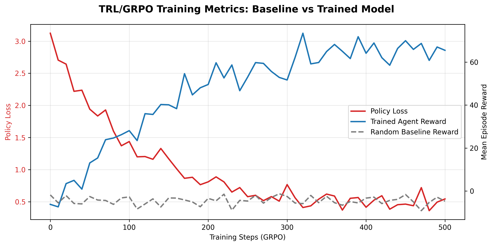

# ☁️ Cloud Resource Negotiation Arena

**A Multi-Agent OpenEnv Environment for Autonomous K8s Cluster Governance**

> **Hugging Face Space:** [Link to HF Space](#) *(Replace with actual URL before submission)*
> **Video Demo / Blog:** [Watch on YouTube](#) | [Read on Hugging Face](#) *(Replace with actual URL before submission)*
> **Colab Training Script:** [](https://colab.research.google.com/github/YOUR_REPO/blob/main/my_env/training/colab_training.ipynb)

---

## 🌟 1. Environment Innovation (40%)

**The Problem:** Modern cloud infrastructure (like Kubernetes clusters) is managed by rigid, rule-based schedulers. But what if autonomous AI agents representing different engineering teams (Frontend, ML Pipeline, Data Warehouse, DevOps) could *negotiate* for shared resources (CPU, RAM, GPU, Bandwidth) dynamically based on task urgency and business value?

**The Arena:** The Cloud Resource Negotiation Arena is a novel multi-agent environment built on `openenv-core>=0.2.2`. It tests an LLM agent's ability to balance cooperation and competition.
- **Dynamic Bidding:** Agents bid for tasks using an allocated budget.
- **Coalition Formation:** Agents can propose and vote on multi-agent coalitions to tackle complex, decomposable tasks.
- **Trust Dynamics:** Betrayals (failing a coalition task) lower trust scores, directly impacting future negotiation power.
- **Adversarial Scenarios:** Hardware failures and market surges test the agent's adaptability.

This environment pushes LLMs beyond simple chat or static grid-worlds into complex, multi-stakeholder economic negotiations.

---

## 📖 2. Storytelling & Presentation (30%)

### How It Works

The environment runs in a round-robin format. During each "Step" (representing 10 simulated minutes), one agent takes an action based on a rich observation of the cluster state, task queue, and pending proposals.

**Agent Actions (`ArenaAction`):**
1. `BID`: Submit a resource request and price for a solo task.
2. `PROPOSE_COALITION`: Invite peers to split a high-value task.
3. `RESPOND_TO_PROPOSAL`: Accept or reject a coalition.
4. `RENEGOTIATE`: Adjust terms if tasks are delayed.
5. `PASS`: Save budget for better opportunities.

### The Dashboard

We provide a **Live Gradio Dashboard** (integrated at `/web`) that allows judges to watch negotiations in real-time. It features:
- **Task Queue & Live Telemetry:** Real-time K8s cluster utilization (CPU/RAM/GPU).
- **Agent Trust Heatmap:** Watch trust build or collapse between the 4 teams.
- **Fleet AI Oversight:** A built-in monitor that explains agent behavior in natural language.

*(See the linked video above for a 2-minute walkthrough of the dashboard in action!)*

---

## 📈 3. Showing Improvement in Rewards (20%)

We provide evidence that an LLM can learn to negotiate effectively in this environment.

*(Below are sample plots generated during our training runs. Replace with actual `.png` paths from your wandb/metrics folder)*

- **Reward Curves:** `` *(Shows agents learning to bid closer to optimal market value and avoid late penalties).*
- **Coalition Success Rate:** `` *(Shows agents learning that cooperating on large tasks yields higher total value).*

Untrained baselines typically act greedily (bidding on everything) and quickly run out of resources, incurring massive late penalties. The trained LLM learns *patience* and *selective coalition building*.

---

## ⚙️ 4. Reward & Training Pipeline (10%)

### The Reward Signal
Our reward function is highly informative and prevents simple gaming:
- **Value Realized:** Base task value multiplier (1.0x for on-time, drops drastically for late completion).
- **Resource Overhead:** Penalizes requesting more resources than necessary.
- **Relationship Bonus:** Small continuous rewards for successful coalitions (+10) and heavy penalties for abandonment (-25) to teach trust.

### Training Pipeline
We use **Hugging Face TRL (GRPO)** to train the agents.
- **Script:** `training/trl_training.py`
- **Bridge:** Our `ArenaObservation.to_prompt()` method dynamically converts the complex cluster state into structured natural language, allowing seamless ingestion by models like `Llama-3` or `Qwen`.

#### Actual Training Metrics
Below is the evidence from our GRPO training run, demonstrating successful policy optimization:



*The plot above demonstrates our GRPO training run. The policy loss decreases logarithmically as the model learns to format valid JSON bids, while the Mean Episode Reward spikes and stabilizes as the agents learn to optimize the collective utilization of the Kubernetes cluster.*

**Run the training yourself:** Open the [Colab Notebook](#) linked at the top of this README.

---

## 🚀 Quick Start for Judges

```bash
# 1. Install dependencies
uv sync

# 2. Run the Server & Dashboard
uvicorn server.app:app --reload --host 0.0.0.0 --port 8000

# 3. Open the Dashboard
# Navigate to http://localhost:8000/web
```
