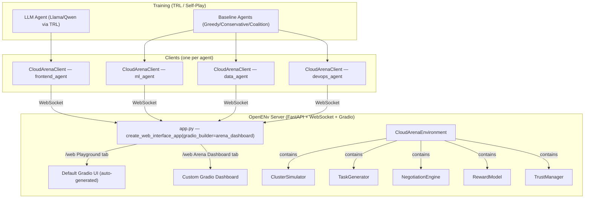

# Cloud Resource Negotiation Arena — Implementation Plan

Build a multi-agent OpenENv environment where 4 AI agents (Frontend, ML Pipeline, Data Warehouse, DevOps) negotiate, bid, and form coalitions over a shared Kubernetes cluster's resources. **Designed to train LLMs on multi-agent negotiation via HF TRL/Unsloth.**

---

## Theme Alignment

| Theme | Fit | How |
|---|---|---|
| **#1 Multi-Agent Interactions** | ✅ PRIMARY | 4 agents negotiate, bid, form coalitions — cooperation + competition |
| **#4 Self-Improvement** | ✅ SECONDARY | Self-play loop where agents improve bidding/trust across episodes |
| Fleet AI Sub-theme | ✅ | Oversight agent can monitor other agents' behavior in the cluster |

---

## Judging Criteria Alignment

| Criterion | Weight | How We Score |
|---|---|---|
| **Environment Innovation** (40%) | ✅ | Novel multi-agent negotiation with coalition formation, trust dynamics, 3 stress scenarios. Inspired by real K8s scheduling. |
| **Storytelling & Demo** (30%) | ✅ | Real-time Gradio dashboard (integrated into OpenENv's `/web` UI) showing live negotiations, resource utilization, reward curves. 3-min compressed demo. |
| **Showing Reward Improvement** (20%) | ✅ | S-curve bidding accuracy, trust graph clustering animation, coalition success rate trends, per-agent reward growth over 100 episodes |
| **Reward & Training Pipeline** (10%) | ✅ | Multi-layer reward model + **TRL GRPO training script** + Colab notebook |

### Mandatory Minimums

| Requirement | Status |
|---|---|
| ✅ Usage of OpenEnv (latest release) | Built on `openenv-core>=0.2.2`, uses `Environment`, `Action`, `Observation`, `EnvClient`, `create_web_interface_app` |
| ✅ Minimal TRL/Unsloth training script in Colab | `trl_training.py` + `colab_training.ipynb` included |
| ✅ Mini-blog/video on HF/YouTube | Noted as deliverable (not code) |

---

## Architecture Overview

We are building fresh — all existing GridWorld practice code in `my_env` will be replaced entirely.



> [!IMPORTANT]
> **Dashboard integrated into Gradio**: OpenENv's `create_web_interface_app()` accepts a `gradio_builder` callback that returns a `gr.Blocks` instance. This gets mounted as a **"Custom" tab** alongside the default "Playground" tab at `/web`. Our arena dashboard (task queue, negotiations, resource utilization, reward curves) will be built as a custom Gradio layout — no separate server needed. It connects to the same `/ws/ui` WebSocket and uses the same `/web/reset`, `/web/step`, `/web/state` endpoints.

> [!IMPORTANT]
> **LLM-as-Agent Design**: Observations include a `to_prompt()` method that renders state as structured natural language. The LLM's text output is parsed back into an `ArenaAction`. This bridges the environment to TRL training.

> [!IMPORTANT]
> **Multi-Agent in a single-env design**: Each `step()` call processes ONE agent's action, tagged with `agent_id`. Agents cycle round-robin within each 10-minute time-step. When all 4 have acted, the environment resolves bids/coalitions and advances the clock.

---

## Proposed Changes

### Component 1 — Data Models

#### [NEW] [models.py](file:///Users/markiv/Desktop/OpenENv/my_env/models.py) (replace existing practice code)

All domain models for the arena — completely replaces the existing GridWorld models.

```python
# --- Enums ---
class ActionType(str, Enum):
    BID = "bid"
    PROPOSE_COALITION = "propose_coalition"
    RESPOND_TO_PROPOSAL = "respond"
    RENEGOTIATE = "renegotiate"
    PASS = "pass"

class AgentRole(str, Enum):
    FRONTEND = "frontend"
    ML_PIPELINE = "ml_pipeline"
    DATA_WAREHOUSE = "data_warehouse"
    DEVOPS = "devops"

class TaskType(str, Enum):
    API_DEPLOYMENT = "api_deployment"
    MODEL_TRAINING = "model_training"
    ETL_PIPELINE = "etl_pipeline"
    MONITORING_STACK = "monitoring_stack"
    AD_HOC_ANALYSIS = "ad_hoc_analysis"
    EMERGENCY_PATCH = "emergency_patch"

# --- Actions ---
class ArenaAction(Action):
    agent_id: AgentRole
    action_type: ActionType
    # BID fields (optional)
    task_id: Optional[str] = None
    resource_request: Optional[Dict[str, float]] = None  # cpu, ram_gb, gpu, bandwidth
    price_offered: Optional[float] = None                 # 0–100% of task value
    eta_minutes: Optional[int] = None
    confidence: Optional[float] = None
    # COALITION fields
    peer_agents: Optional[List[AgentRole]] = None
    subtask_split: Optional[Dict[str, str]] = None
    reward_split: Optional[Dict[str, float]] = None
    # RESPOND fields
    proposal_id: Optional[str] = None
    acceptance: Optional[bool] = None
    # RENEGOTIATE fields
    new_deadline: Optional[int] = None
    new_resource_split: Optional[Dict[str, float]] = None

# --- Observation sub-models ---
class TaskInfo(BaseModel):
    task_id: str
    task_type: TaskType
    team_affinity: AgentRole
    resources: Dict[str, float]       # cpu, ram_gb, gpu, bandwidth
    deadline_minutes: int
    base_value: float
    subtasks: List[Dict[str, Any]]
    time_remaining: int

class ClusterState(BaseModel):
    cpu_used: float;   cpu_total: float
    ram_used: float;   ram_total: float
    gpu_used: float;   gpu_total: float
    bw_used: float;    bw_total: float

class AgentState(BaseModel):
    agent_id: AgentRole
    reputation: float
    tasks_in_flight: List[str]
    resource_budget_remaining: Dict[str, float]
    total_reward: float

class ProposalInfo(BaseModel):
    proposal_id: str
    proposer: AgentRole
    task_id: str
    peer_agents: List[AgentRole]
    subtask_split: Dict[str, str]
    reward_split: Dict[str, float]

# --- Main Observation ---
class ArenaObservation(Observation):
    current_round: int
    current_agent: AgentRole
    phase: int                                           # 1 = individual, 2 = collective
    cluster: ClusterState
    task_queue: List[TaskInfo]
    agents: List[AgentState]
    pending_proposals: List[ProposalInfo]
    recent_completions: List[Dict[str, Any]]
    negotiation_log: List[Dict[str, Any]]
    trust_scores: Dict[str, Dict[str, float]]            # agent → agent → trust

    def to_prompt(self) -> str:
        """Render observation as natural language for LLM agents."""
        # Structured text: role, cluster state, tasks, proposals, trust, instructions
        ...
```

---

### Component 2 — Core Environment (Server-Side)

#### [NEW] [server/cluster_simulator.py](file:///Users/markiv/Desktop/OpenENv/my_env/server/cluster_simulator.py)

Manages the simulated K8s cluster's resource pool.

- Total: 500 CPU, 2TB RAM, 8 GPU, 100 Mbps bandwidth
- `allocate(resources) → bool`, `release(resources)`, `utilization() → Dict[str, float]`
- **3 scenarios**: Normal (80%), Peak (95%), Failure (agent kill at random step)

#### [NEW] [server/task_generator.py](file:///Users/markiv/Desktop/OpenENv/my_env/server/task_generator.py)

Poisson task arrival (λ=1.5 per 10-min window).

- 6 task types with resource profiles, deadlines, values from the problem statement
- Unique IDs, subtask decomposition, 70/30 predictable/urgent mix

#### [NEW] [server/negotiation_engine.py](file:///Users/markiv/Desktop/OpenENv/my_env/server/negotiation_engine.py)

Bid/coalition resolution at end of each round.

- Bid resolution: highest `price_offered` wins; ties broken by reputation
- Coalition: unanimous accept → split & assign; any reject → fail
- Renegotiation: majority vote → update terms

#### [NEW] [server/reward_model.py](file:///Users/markiv/Desktop/OpenENv/my_env/server/reward_model.py)

```
agent_reward = (task_value × completion_multiplier) - (resource_cost × overhead_factor) + relationship_bonus
```

- On-time 1.0×, 1–30 min late 0.8×, 30–60 min late 0.5×, >60 min −50
- Solo overhead 1.0, coalition 0.85
- +10 per successful coalition (max 3), −25 for abandonment
- Collective reward for Phase 2 (episodes 51–100)

#### [NEW] [server/trust_manager.py](file:///Users/markiv/Desktop/OpenENv/my_env/server/trust_manager.py)

Trust graph: `Trust(A→B) ∈ [0,1]`, starts 0.5, +0.1 success, −0.05 failure, half-life 20 episodes.

#### [NEW] [server/cloud_arena_environment.py](file:///Users/markiv/Desktop/OpenENv/my_env/server/cloud_arena_environment.py)

Core environment — replaces all existing practice code.

```python
class CloudArenaEnvironment(Environment):
    SUPPORTS_CONCURRENT_SESSIONS = True

    def __init__(self, num_agents=4, task_arrival_rate=1.5, scenario="normal"):
        super().__init__()
        self.cluster = ClusterSimulator(scenario=scenario)
        self.task_gen = TaskGenerator(arrival_rate=task_arrival_rate)
        self.negotiation = NegotiationEngine()
        self.rewards = RewardModel()
        self.trust = TrustManager(num_agents=num_agents)
        # ...

    def reset(self, seed=None, episode_id=None, **kwargs) -> ArenaObservation: ...
    def step(self, action: ArenaAction, **kwargs) -> ArenaObservation: ...
    
    @property
    def state(self) -> State: ...
```

**Round lifecycle** (each "step" = one agent acting):
```
Round N:
  Step 4N+0: frontend acts   → obs for ml_pipeline
  Step 4N+1: ml_pipeline acts → obs for data_warehouse
  Step 4N+2: data_warehouse acts → obs for devops
  Step 4N+3: devops acts     → RESOLVE ROUND → obs for frontend (round N+1)
```

#### [DELETE] [server/my_env_environment.py](file:///Users/markiv/Desktop/OpenENv/my_env/server/my_env_environment.py)

Practice code — replaced by `cloud_arena_environment.py`.

---

### Component 3 — Client

#### [NEW] [client.py](file:///Users/markiv/Desktop/OpenENv/my_env/client.py) (replace existing)

```python
class CloudArenaClient(EnvClient[ArenaAction, ArenaObservation, State]):
    def _step_payload(self, action: ArenaAction) -> Dict:
        return action.model_dump(exclude_none=True)

    def _parse_result(self, payload: Dict) -> StepResult[ArenaObservation]:
        obs_data = payload.get("observation", {})
        return StepResult(
            observation=ArenaObservation(**obs_data),
            reward=payload.get("reward"),
            done=payload.get("done", False),
        )

    def _parse_state(self, payload: Dict) -> State:
        return State(**payload)
```

---

### Component 4 — Module Wiring

#### [NEW] [\_\_init\_\_.py](file:///Users/markiv/Desktop/OpenENv/my_env/__init__.py) (replace existing)

Export `ArenaAction`, `ArenaObservation`, `ActionType`, `AgentRole`, `TaskType`, `CloudArenaClient`, etc.

#### [NEW] [server/\_\_init\_\_.py](file:///Users/markiv/Desktop/OpenENv/my_env/server/__init__.py) (replace existing)

Export `CloudArenaEnvironment`.

#### [NEW] [server/app.py](file:///Users/markiv/Desktop/OpenENv/my_env/server/app.py) (replace existing)

Wire the environment with the **integrated Gradio dashboard**:

```python
from openenv.core.env_server import create_web_interface_app
from .cloud_arena_environment import CloudArenaEnvironment
from ..models import ArenaAction, ArenaObservation
from .gradio_dashboard import build_arena_dashboard

app = create_web_interface_app(
    CloudArenaEnvironment,
    ArenaAction,
    ArenaObservation,
    env_name="cloud_resource_negotiation_arena",
    max_concurrent_envs=4,
    gradio_builder=build_arena_dashboard,  # ← Custom Gradio dashboard tab
)
```

#### [MODIFY] [openenv.yaml](file:///Users/markiv/Desktop/OpenENv/my_env/openenv.yaml)

```yaml
spec_version: 1
name: cloud_resource_negotiation_arena
type: space
runtime: fastapi
app: server.app:app
port: 8000
```

#### [MODIFY] [pyproject.toml](file:///Users/markiv/Desktop/OpenENv/my_env/pyproject.toml)

Add `numpy`, `plotly` (for Gradio charts), update name/description.

---

### Component 5 — Integrated Gradio Dashboard

> [!IMPORTANT]
> The dashboard is **inside the Gradio `/web` UI**, not a separate app. It uses OpenENv's `gradio_builder` callback in `create_web_interface_app()` to add a custom tab called "Arena Dashboard" alongside the auto-generated "Playground" tab.

#### [NEW] [server/gradio_dashboard.py](file:///Users/markiv/Desktop/OpenENv/my_env/server/gradio_dashboard.py)

Custom Gradio `gr.Blocks` layout implementing the 4-pane arena dashboard:

```python
def build_arena_dashboard(web_manager, action_fields, metadata,
                          is_chat_env, title, quick_start_md) -> gr.Blocks:
    """Build custom Arena Dashboard as a Gradio Blocks app.
    
    This gets mounted as a "Custom" tab at /web alongside the default 
    Playground tab. Uses gr.Plot for charts, gr.Dataframe for task queue,
    gr.Markdown for negotiation log, and gr.Timer for auto-refresh.
    """
    with gr.Blocks(title="Arena Dashboard") as dashboard:
        gr.Markdown("# ☁️ Cloud Resource Negotiation Arena")
        
        with gr.Row():
            # LEFT: Task Queue
            with gr.Column(scale=1):
                gr.Markdown("### 📋 Task Queue")
                task_table = gr.Dataframe(
                    headers=["ID", "Type", "Team", "Value", "Deadline", "Status"],
                    label="Active Tasks"
                )
            
            # CENTER: Negotiation Log
            with gr.Column(scale=1):
                gr.Markdown("### 💬 Negotiations")
                negotiation_log = gr.Chatbot(label="Agent Messages", height=400)
            
            # RIGHT: Resource Utilization
            with gr.Column(scale=1):
                gr.Markdown("### 📊 Cluster Resources")
                resource_chart = gr.Plot(label="Utilization")
        
        with gr.Row():
            # BOTTOM: Reward Curves
            with gr.Column():
                gr.Markdown("### 📈 Learning Progress")
                reward_chart = gr.Plot(label="Reward per Agent")
                trust_heatmap = gr.Plot(label="Trust Matrix")
        
        # Auto-refresh via Timer (polls /web/state)
        timer = gr.Timer(value=2)  # Refresh every 2 seconds
        timer.tick(fn=refresh_dashboard, outputs=[task_table, negotiation_log, 
                                                   resource_chart, reward_chart,
                                                   trust_heatmap])
    
    return dashboard
```

**Dashboard features:**
- **Task Queue**: `gr.Dataframe` — sortable table color-coded by urgency
- **Negotiation Log**: `gr.Chatbot` — styled as agent message bubbles (bids, proposals, responses)
- **Resource Utilization**: `gr.Plot` (Plotly) — donut charts for CPU/RAM/GPU/BW
- **Reward Curves**: `gr.Plot` (Plotly) — per-agent reward lines updating each round
- **Trust Heatmap**: `gr.Plot` (Plotly) — 4×4 matrix of inter-agent trust scores
- **Auto-refresh**: `gr.Timer` polls server state every 2 seconds during live episodes

---

### Component 6 — Agent Strategies (Python Baselines)

#### [NEW] [agents/\_\_init\_\_.py](file:///Users/markiv/Desktop/OpenENv/my_env/agents/__init__.py)
#### [NEW] [agents/base_agent.py](file:///Users/markiv/Desktop/OpenENv/my_env/agents/base_agent.py)

Abstract base: `decide(observation) → ArenaAction`, `update(reward)`.

#### [NEW] [agents/greedy_agent.py](file:///Users/markiv/Desktop/OpenENv/my_env/agents/greedy_agent.py)

Always bids on highest-value task solo.

#### [NEW] [agents/conservative_agent.py](file:///Users/markiv/Desktop/OpenENv/my_env/agents/conservative_agent.py)

Only bids on team-affinity tasks with high confidence.

#### [NEW] [agents/coalition_agent.py](file:///Users/markiv/Desktop/OpenENv/my_env/agents/coalition_agent.py)

Proactively proposes coalitions. Uses trust scores for partner selection.

#### [NEW] [agents/learning_agent.py](file:///Users/markiv/Desktop/OpenENv/my_env/agents/learning_agent.py)

Thompson Sampling for bids + trust-weighted coalition selection. Self-improving.

---

### Component 7 — LLM Agent & TRL Training (CRITICAL for judging)

#### [NEW] [agents/llm_agent.py](file:///Users/markiv/Desktop/OpenENv/my_env/agents/llm_agent.py)

LLM-powered agent:

```python
class LLMAgent(BaseAgent):
    def __init__(self, role, model, tokenizer):
        self.model = model
        self.tokenizer = tokenizer
        self.role = role
    
    def decide(self, observation: ArenaObservation) -> ArenaAction:
        prompt = observation.to_prompt()
        messages = [
            {"role": "system", "content": SYSTEM_PROMPT},
            {"role": "user", "content": prompt},
        ]
        input_ids = self.tokenizer.apply_chat_template(messages, return_tensors="pt")
        output = self.model.generate(input_ids, max_new_tokens=256)
        response_text = self.tokenizer.decode(output[0], skip_special_tokens=True)
        return parse_action_from_text(response_text, self.role)
```

#### [NEW] [trl_training.py](file:///Users/markiv/Desktop/OpenENv/my_env/trl_training.py)

**TRL GRPO training script** — mandatory deliverable:

```python
from trl import GRPOTrainer, GRPOConfig
from transformers import AutoTokenizer, AutoModelForCausalLM

def reward_fn(completions, prompts, **kwargs):
    """Run completions through the env and return rewards."""
    rewards = []
    for completion in completions:
        try:
            action = parse_action_from_text(completion)
            result = env_client.step(action)
            rewards.append(result.reward or 0.0)
        except Exception:
            rewards.append(-1.0)
    return rewards

model = AutoModelForCausalLM.from_pretrained("meta-llama/Llama-3.2-1B-Instruct")
tokenizer = AutoTokenizer.from_pretrained("meta-llama/Llama-3.2-1B-Instruct")

trainer = GRPOTrainer(model=model, config=GRPOConfig(...), 
                      reward_funcs=reward_fn, tokenizer=tokenizer)
trainer.train()
```

#### [NEW] [colab_training.ipynb](file:///Users/markiv/Desktop/OpenENv/my_env/colab_training.ipynb)

Runnable Colab: install deps → start server → run 10-episode training → show reward curves.

---

### Component 8 — Training Runner (Self-Play)

#### [NEW] [training_runner.py](file:///Users/markiv/Desktop/OpenENv/my_env/training_runner.py)

Two modes:
1. **Baseline**: 4 Python agents for rapid iteration
2. **LLM**: 1 LLM agent + 3 baselines for TRL training

---

### Component 9 — Metrics & Visualization

#### [NEW] [metrics/\_\_init\_\_.py](file:///Users/markiv/Desktop/OpenENv/my_env/metrics/__init__.py)
#### [NEW] [metrics/collector.py](file:///Users/markiv/Desktop/OpenENv/my_env/metrics/collector.py)

Tracks bidding accuracy, win rate, coalition success, avg reward, reputation per episode.

#### [NEW] [metrics/visualizer.py](file:///Users/markiv/Desktop/OpenENv/my_env/metrics/visualizer.py)

Matplotlib/Plotly plots: S-curve learning, reward growth, trust animation. PNGs + JSON output.

---

## Complete File Summary

| Action | File | Purpose |
|--------|------|---------|
| REPLACE | `models.py` | Arena action/observation models + `to_prompt()` |
| REPLACE | `client.py` | `CloudArenaClient` |
| REPLACE | `__init__.py` | Updated exports |
| REPLACE | `server/__init__.py` | Updated exports |
| REPLACE | `server/app.py` | Wire env + Gradio dashboard |
| MODIFY | `openenv.yaml` | Update env name |
| MODIFY | `pyproject.toml` | Add numpy, plotly deps |
| DELETE | `server/my_env_environment.py` | Practice code removed |
| NEW | `server/cloud_arena_environment.py` | Core environment logic |
| NEW | `server/cluster_simulator.py` | K8s cluster resource simulation |
| NEW | `server/task_generator.py` | Poisson task arrival |
| NEW | `server/negotiation_engine.py` | Bid/coalition resolution |
| NEW | `server/reward_model.py` | Multi-layer reward computation |
| NEW | `server/trust_manager.py` | Trust graph management |
| NEW | `server/gradio_dashboard.py` | **Integrated Gradio dashboard (custom tab)** |
| NEW | `agents/__init__.py` | Agent module |
| NEW | `agents/base_agent.py` | Abstract agent interface |
| NEW | `agents/greedy_agent.py` | Greedy baseline |
| NEW | `agents/conservative_agent.py` | Conservative baseline |
| NEW | `agents/coalition_agent.py` | Coalition-focused baseline |
| NEW | `agents/learning_agent.py` | Self-improving agent (Thompson Sampling) |
| NEW | `agents/llm_agent.py` | **LLM-based agent (HF transformers)** |
| NEW | `trl_training.py` | **TRL GRPO training script (mandatory)** |
| NEW | `colab_training.ipynb` | **Colab notebook (mandatory)** |
| NEW | `training_runner.py` | Multi-agent episode orchestrator |
| NEW | `metrics/__init__.py` | Metrics module |
| NEW | `metrics/collector.py` | Episode metrics tracking |
| NEW | `metrics/visualizer.py` | Learning curve plots |

---

## Execution Priority Order

Build order by judging impact (48-hour hackathon):

| Priority | Hours | Component | Judging Impact |
|---|---|---|---|
| **P0** | 0–6 | `models.py` + `cloud_arena_environment.py` (with PASS-only steps working) | Env Innovation (40%) |
| **P0** | 6–10 | `cluster_simulator` + `task_generator` + `negotiation_engine` | Env Innovation (40%) |
| **P0** | 10–13 | `reward_model` + `trust_manager` | Reward Pipeline (10%) + Env (40%) |
| **P1** | 13–16 | `llm_agent.py` + `to_prompt()` + action parsing | Training Pipeline (10%) |
| **P1** | 16–19 | `trl_training.py` + `colab_training.ipynb` | Training Pipeline (10%) — **MANDATORY** |
| **P1** | 19–24 | `gradio_dashboard.py` (integrated into `/web`) | Storytelling (30%) |
| **P2** | 24–30 | Baseline agents (greedy, conservative, coalition, learning) | Reward Improvement (20%) |
| **P2** | 30–36 | `training_runner.py` + `metrics/collector.py` | Reward Improvement (20%) |
| **P2** | 36–42 | Run 100 episodes, generate learning curves | Reward Improvement (20%) |
| **P3** | 42–48 | Dashboard polish, demo scenario, README, blog/video | Storytelling (30%) |

> [!WARNING]
> **Critical Path**: `models.py` + `cloud_arena_environment.py` block everything. Get stepping with PASS actions working first, then layer on complexity.

---

## User Review Required

> [!IMPORTANT]
> **LLM model choice**: Should we target `meta-llama/Llama-3.2-1B-Instruct` (small, fast, Meta's own model) or `Qwen/Qwen2.5-1.5B-Instruct`? Smaller models train faster in Colab. HF compute credits come on-site for larger models.

> [!IMPORTANT]
> **Multi-agent stepping**: Each `step()` = one agent acting (round-robin, 4 agents per round). Sound right?

---

## Verification Plan

### Automated Tests

```bash
# 1. Server starts and health check
uvicorn server.app:app --port 8000 &
curl http://localhost:8000/health

# 2. Smoke test: 4 PASS actions = 1 round
python -c "
from my_env import CloudArenaClient, ArenaAction, ActionType, AgentRole
client = CloudArenaClient(base_url='http://localhost:8000').sync()
with client:
    result = client.reset()
    for _ in range(16):
        action = ArenaAction(agent_id=result.observation.current_agent, action_type=ActionType.PASS)
        result = client.step(action)
    print('Round:', result.observation.current_round)
"

# 3. Baseline self-play
python training_runner.py --episodes 10 --url http://localhost:8000

# 4. TRL training smoke test
python trl_training.py --model Qwen/Qwen2.5-0.5B-Instruct --episodes 3
```

### Manual Verification

- Open `http://localhost:8000/web` → verify two tabs: "Playground" + "Arena Dashboard"
- Dashboard shows live task queue, negotiation log, resource charts during episodes
- Learning curves show improvement trend over 100 episodes
- Trust heatmap shows clustering
- LLM agent outputs valid JSON actions

### Build & Deploy

```bash
cd /Users/markiv/Desktop/OpenENv/my_env
uv sync
uv run server
# Open http://localhost:8000/web
```
